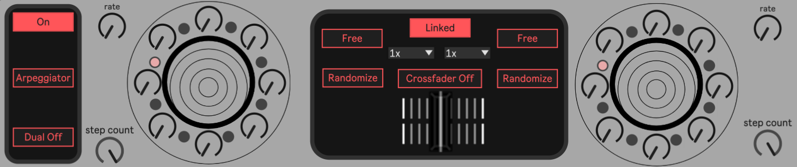

# moscow
## 8 / 16 step sequencer built for m4l

8 / 16 step sequencer which features both tempo-sync'd as well as free running bpm /n
adjustable step count with individual note on/off switches /n
arpeggiator with multiple octave settings /n
crossfader between second channel sequencer /n

